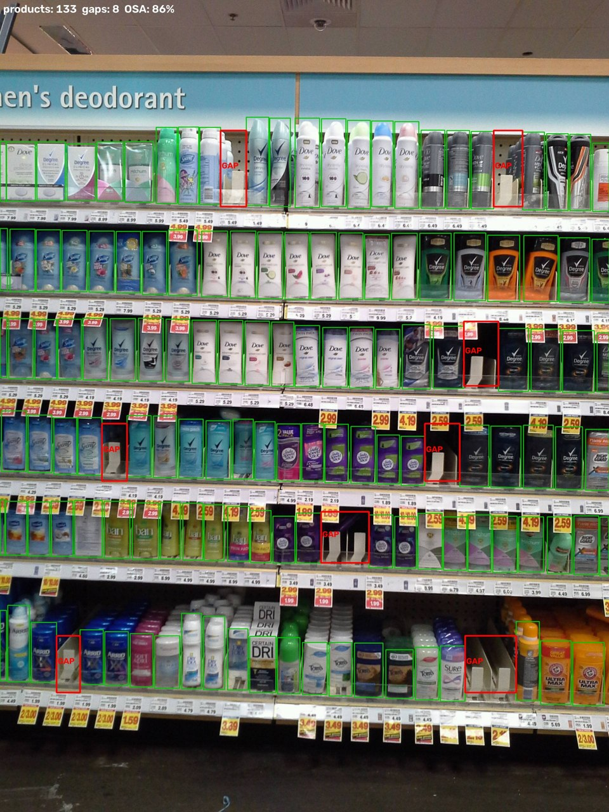
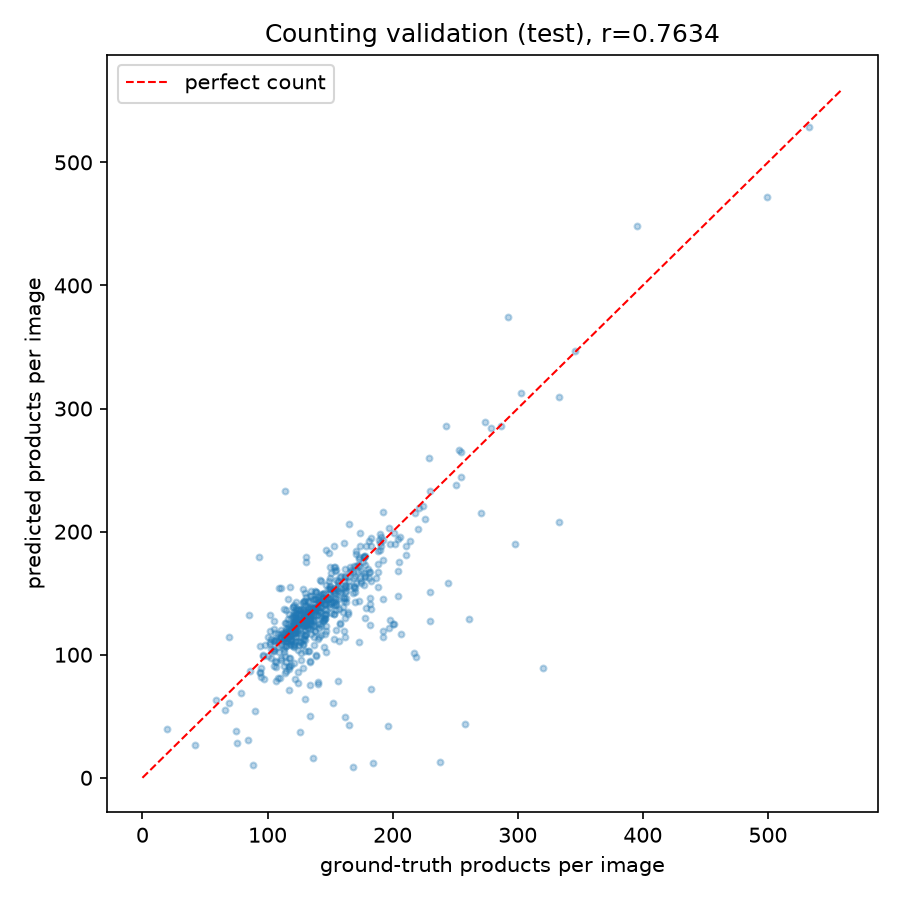
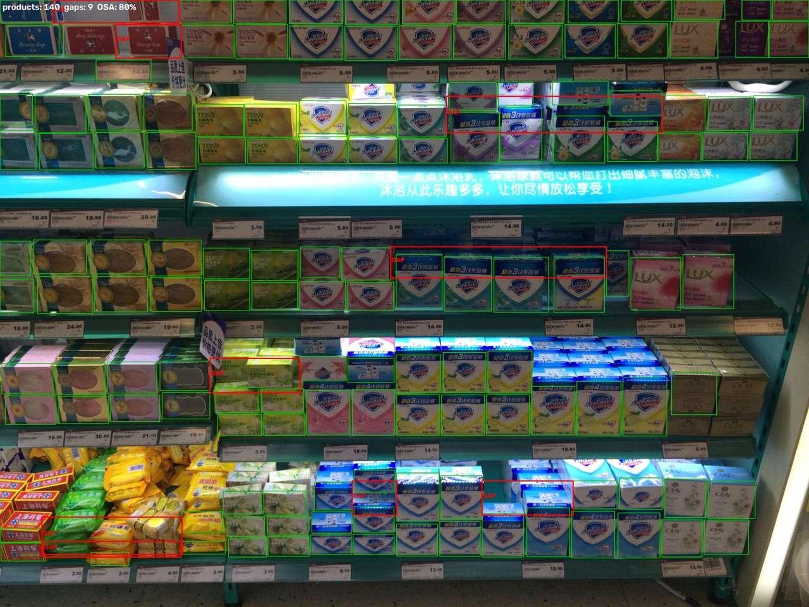

# Retail Shelf Monitoring: Dense Product Detection & Out-of-Stock Alerts

Fine-tuning a small **YOLO** detector on **SKU-110K** (real supermarket shelf
photos) to detect every product facing on a shelf, then deriving
**out-of-stock gap alerts** and an **on-shelf availability (OSA) score** from
the detections — the metric a store manager actually cares about.



*133 products detected (green), 8 empty slots flagged as gaps (red), shelf
availability 86% — produced by `src/detect_gaps.py` on an unseen test image.*

## Business problem

Retailers lose an estimated ~4% of revenue to out-of-stocks: the product
exists in the back room, but the shelf slot is empty and nobody notices.
Shelf audits are done manually today (an employee walks the aisles with a
clipboard). A camera + this model turns that into an automatic, continuous
process:

1. detect every product facing on the shelf,
2. cluster detections into shelf rows,
3. flag suspiciously wide empty stretches inside a row as **gaps**,
4. report OSA = occupied shelf width / total shelf width.

## Dataset

[SKU-110K](https://github.com/eg4000/SKU110K_CVPR19) (Goldman et al.,
*CVPR 2019*): 11,762 real supermarket shelf photos with ~1.7M annotated
bounding boxes — on average **~147 products per image**, which makes it a
benchmark for *densely packed* object detection. Splits: 8,219 train /
588 val / 2,936 test. Auto-downloaded (~13.6 GB) by Ultralytics on first
run via the built-in `SKU-110K.yaml`.

Only one class ("object"): the task is class-agnostic product detection,
which is exactly what gap/OSA monitoring needs (brand identity is not
required to see that a slot is empty).

## Method

- **Model:** YOLO11n (~2.6M parameters), fine-tuned at 640 px,
  mixed precision on a laptop RTX 3060 (6 GB).
- **Density:** default detector settings silently cap detections
  (`max_det=300`) below the density of a real shelf (up to ~700 boxes);
  evaluation and inference raise this cap. Small, tightly packed, highly
  self-similar objects are the core difficulty.
- **Business metric, not just mAP:** per test image, predicted product
  count vs ground-truth count (MAE, MAPE, Pearson r) — "how many facings
  are on this shelf" is what inventory systems consume.
- **Gap detection is derived, not learned:** SKU-110K has no "gap" labels.
  Gaps come from geometry: within each detected shelf row, an empty
  horizontal stretch wider than ~80% of the row's median product width is
  flagged. This keeps the detector generic and makes the alert logic
  transparent and tunable.

## Results

Test split: 2,935 unseen images, 431,419 annotated products. Counting
metrics computed on 600 test images at confidence 0.35.

| Metric (test split) | Value |
|---|---|
| mAP@0.5 | **0.896** |
| mAP@0.5:0.95 | 0.538 |
| Precision / Recall | 0.889 / 0.821 |
| Count MAE (products/image) | 18.3 |
| Count MAPE | 12.3% |
| Count Pearson r | 0.76 |
| Inference speed (RTX 3060 laptop) | ~4.4 ms/image |

The mean test shelf holds ~147 products, so an average counting error of
18 facings (12.3%) comes mostly from the hardest cases: extreme viewing
angles and products at the image border. The counting scatter shows the
model tracks shelf density well:



A denser example — 140 facings tracked on a single shelf photo:



More qualitative gap-detection examples are generated into `outputs/gaps/`.

**Training note:** on a 6 GB card the default batch of 8 gradually
overflows dedicated VRAM into shared memory and slows down badly; this run
used 4 epochs at batch 8 followed by 11 epochs at batch 4 (`--batch 4` is
recommended on 6 GB GPUs).

## Reproduce

```bash
pip install torch torchvision --index-url https://download.pytorch.org/whl/cu124
pip install -r requirements.txt

# smoke test (2% of training data, 1 epoch) - also triggers dataset download
python src/train.py --fraction 0.02 --epochs 1

# full fine-tune (use --batch 4 on 6 GB GPUs, see training note above)
python src/train.py --epochs 15

# detection mAP + counting validation on the test split
python src/evaluate.py --checkpoint outputs/yolo-sku110k/weights/best.pt

# out-of-stock gap detection + OSA score on sample shelf images
python src/detect_gaps.py --checkpoint outputs/yolo-sku110k/weights/best.pt --n 6
```

## Reference

Goldman, E. et al. (2019). *Precise Detection in Densely Packed Scenes.*
CVPR 2019. https://arxiv.org/abs/1904.00853
